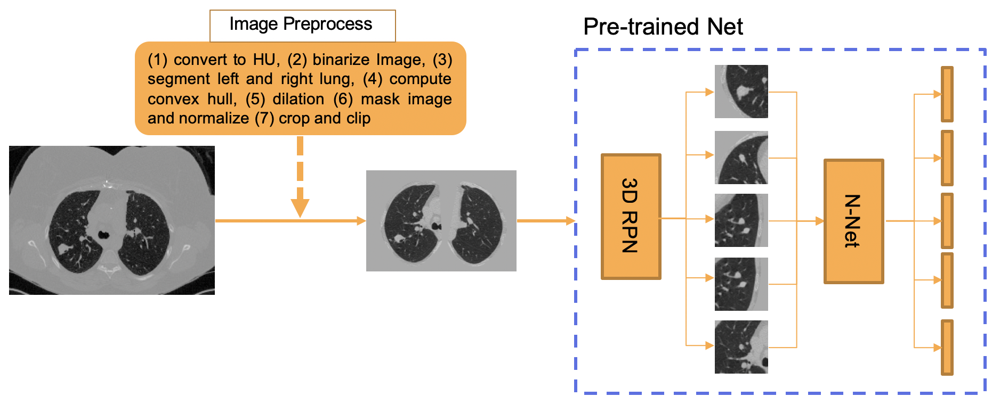
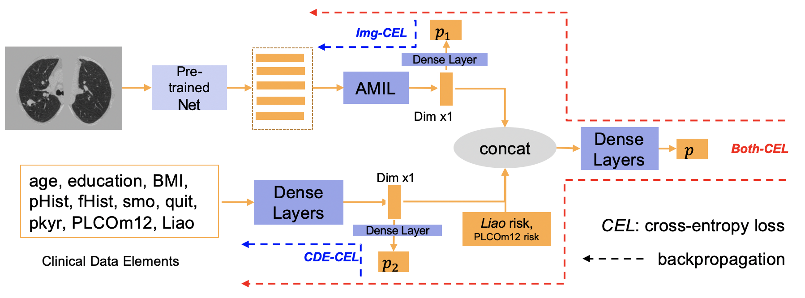

# DeepOpenLung Overview

This is the Deep Learning Open-source Lung cancer risk estimation repository, with PyTorch implementations. We prevoide source code, running tutorial, docker, and example image here.

Please see the requirement in the Dockerfile. Different version packages should be easy to adapt (not guarantee). 

# Tutorial

All the steps can be find in run_all.sh. A INPUTS and OUTPUTS example can be found here. 



<p align="center"> Fig. 1. Step 1-3 are summarized in this Figure </p>


## step 1: image pre-process

> python3 ./1_preprocess/step1_main.py --sess_csv ${SPLIT_CSV} --prep_root ${PREP_ROOT} --ori_root ${ORI_ROOT}

```${SPLIT_CSV}``` is the csv file stores the scan list (and meta data) you want to test. 
```${PREP_ROOT}``` is the data folder saves the pre-processed result.
```${ORI_ROOT}``` is the data folder stores the scans you want to test.

## step 2: nodule detection

> python3 ./2_nodule_detection/step2_main.py --sess_csv ${SPLIT_CSV} --bbox_root ${BBOX_ROOT} --prep_root ${PREP_ROOT} --config ${CONFIG_PATH} 

```${BBOX_ROOT}``` is the data folder stores the nodule detection results.
```${CONFIG_PATH}``` is the config file path.


## step 3: feature extraction

> python3 ./3_feature_extraction/step3_main.py --sess_csv ${SPLIT_CSV} --bbox_root ${BBOX_ROOT} --prep_root ${PREP_ROOT} --feat_root ${FEAT_ROOT} --config ${CONFIG_PATH}

```${FEAT_ROOT}``` is the data folder stores the image feature results.


<p align="center"> Fig. 2. Step 4 are summarized in this Figure</p>

## step 4: co-learning of meta data and image

> python3 ./4_co_learning/step4_main.py --sess_csv ${SPLIT_CSV} --feat_root ${FEAT_ROOT} --save_csv_path ${PRED_CSV}

```${PRED_CSV}``` is the predicted result from deep learning method.

## step 5: create pdf report

> python3 ./5_create_pdf.py --save_csv_path ${PRED_CSV} --save_txt_path ${CLS_TXT} --save_prep_path ${PREP_ROOT} --save_pdf_path ${PDF_ROOT}


# Docker

Docker image can be downloaded from docker hub: rg15/deeplunggpu:0.4 (built from Docker.gpu), rg15/deeplungcpu:0.3 (built from Docker.cpu)

INPUTS / OUTPUTS / config.yaml example can be downloaded from: 
https://vanderbilt.box.com/s/6h6388kw6h4jbjogd8yk1xqp9eotd3tv

the example .csv file report can be found at OUPUTS/Metrics/CSV

Example command line: 

Note: there is a variable 'gpu' in config.yaml. set 'gpu' as 'True' in GPU version, 'gpu' as 'False' in CPU version. 

(1)For NIfTI-cpu: 
> sudo docker run -u root -v {LOCAL INPUTS PATH}:/INPUTS/ -v {LOCAL OUTPUTS PATH}:/OUTPUTS/ -v {LCOAL CONFIG PATH}:/config.yaml -v {LOCAL LOG PATH}:/LOG rg15/deeplungcpu:0.2 sh run_all.sh  /INPUTS /OUTPUTS /config.yaml /LOG

(2) For DICOM-cpu: 
> sudo docker run -u root -v {LOCAL INPUTS PATH}:/INPUTS/ -v {LOCAL OUTPUTS PATH}:/OUTPUTS/ -v {LCOAL CONFIG PATH}:/config.yaml -v {LOCAL LOG PATH}:/LOG rg15/deeplungcpu:0.2 sh run_all_DICOM.sh /INPUTS /OUTPUTS /config.yaml /LOG

(3) GPU-nifti: 
> sudo nvidia-docker run -u root -v {LOCAL INPUTS PATH}:/INPUTS/ -v {LOCAL OUTPUTS PATH}:/OUTPUTS/ -v {LCOAL CONFIG PATH}:/config.yaml -v {LOCAL LOG PATH}:/LOG rg15/deeplunggpu:0.3 sh run_all.sh /INPUTS /OUTPUTS /config.yaml /LOG

(4) GPU-DICOM: 
> sudo nvidia-docker run -u root -v {LOCAL INPUTS PATH}:/INPUTS/ -v {LOCAL OUTPUTS PATH}:/OUTPUTS/ -v {LCOAL CONFIG PATH}:/config.yaml -v {LOCAL LOG PATH}:/LOG rg15/deeplunggpu:0.3 sh run_all_DICOM.sh /INPUTS /OUTPUTS /config.yaml /LOG


In this version, the "/INPUTS", "/OUTPUTS" and "/config.yaml" are self-defined path for INPUTS, OUTPUTS and config. User can change it. If left blank, "/INPUTS", "/OUTPUTS" and "/config.yaml" are default values. 
